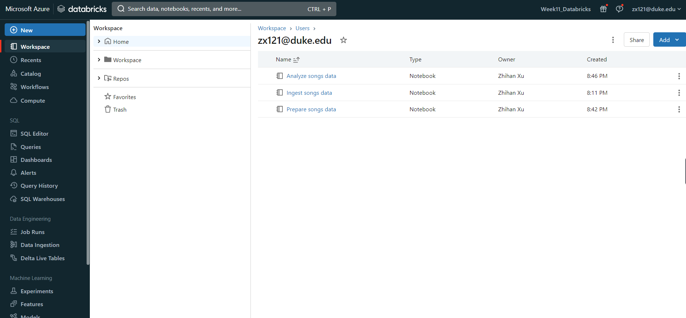
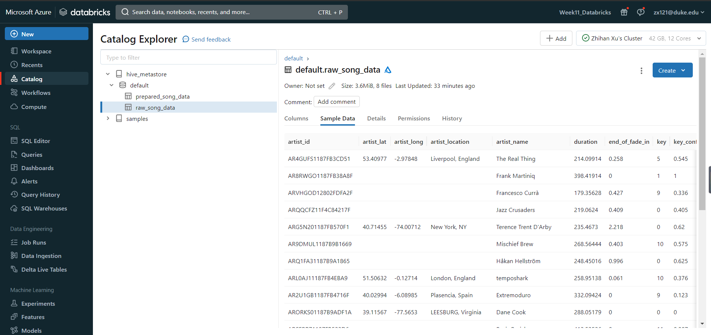
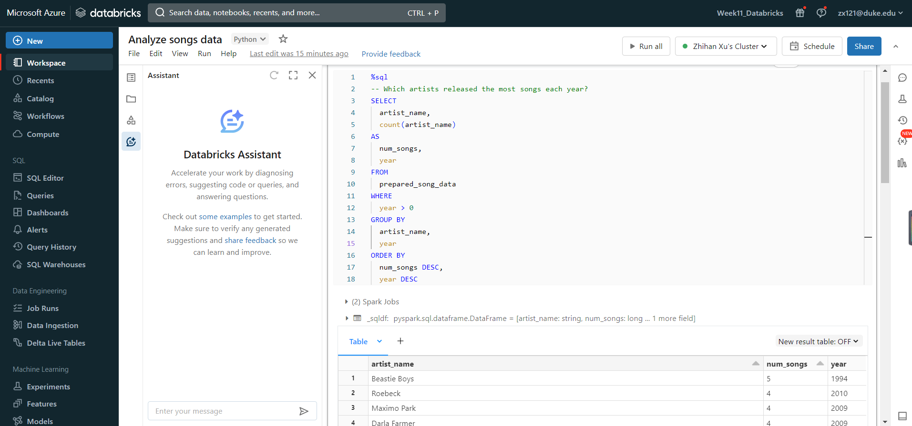
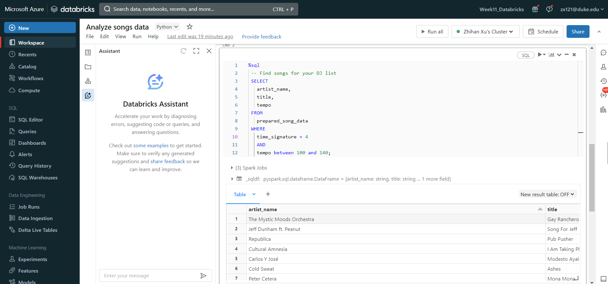
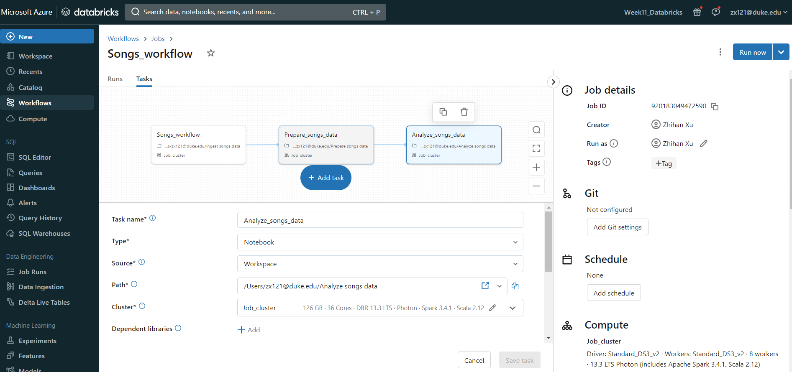

# Week 11: Data Pipeline with Databricks

## Requirements
- Create a data pipeline using Databricks
- Include at least one data source and one data sink

## Results

### Prepare the notebooks in the workspace

### Ingest the songs data

### Query the transformed data
**Which artists released the most songs each year?**

**Find songs for your DJ list**

### Create the Databricks workflow

# References
https://docs.databricks.com/en/getting-started/data-pipeline-get-started.html

